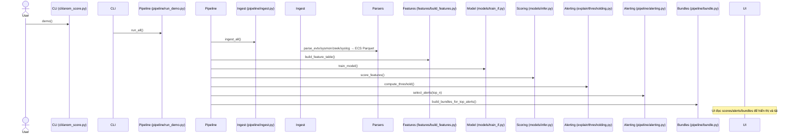

## 1) Executive Summary (Non-Tech)

- Dự án loganom-ai-demo là một bản demo chạy offline giúp phát hiện bất thường (anomaly) trong log an ninh mạng và tạo ra gói pháp chứng (forensic bundle) sẵn sàng cho điều tra.
- Đầu vào là các log tổng hợp (Windows Security, Sysmon, Zeek conn, Syslog auth) đã được cung cấp sẵn trong thư mục `sample_data/`.
- Hệ thống chuẩn hóa log về chuẩn Elastic Common Schema (ECS), lưu dạng Parquet, sau đó trích xuất các đặc trưng theo thời gian (đếm/tỷ lệ 1-5-15 phút), entropy chuỗi lệnh, và session hóa theo 5-tuple mạng.
- Mô hình phát hiện bất thường sử dụng Isolation Forest (không cần nhãn), cho ra điểm số bất thường cho từng sự kiện/record.
- Những record có điểm cao (vượt ngưỡng) được coi là cảnh báo; với các cảnh báo top-N, hệ thống tính giải thích (SHAP/fallback) và đóng gói gói pháp chứng gồm raw logs ±5 phút, vector đặc trưng, kết quả giải thích, meta model, manifest kèm SHA256.
- Kết quả hữu hình: file điểm số (`data/scores/scores.parquet`), bảng cảnh báo top-N, các file `.zip` forensic bundle trong `bundles/`, và giao diện Streamlit để xem timeline điểm, chi tiết host, và tải bundle.
- Lợi ích: chạy nhanh (<2 phút), dữ liệu nhỏ, hoàn toàn offline, minh bạch pipeline, có giải thích và bundle pháp chứng.
- Giới hạn: dữ liệu ít, đặc trưng đơn giản, mô hình chỉ là baseline (IF), SHAP có fallback trong một số môi trường Windows/NumPy; UI còn cơ bản.
- Phù hợp cho demo kiến trúc, POC, đào tạo; cần mở rộng dữ liệu/đặc trưng để áp dụng thực tế.


## 2) Kiến trúc tổng quan (Overview Architecture)

```mermaid
flowchart LR
  A[Log Sources<br/>Windows, Sysmon, Zeek, Syslog] --> B[Ingest + ECS Normalize
(parsers/*, ecs_mapper)]
  B --> C[Partitioned Parquet Store
(data/ecs_parquet/...)]
  C --> D[Feature Engineering
(features/*)]
  D --> E[Modeling
Isolation Forest]
  E --> F[Scoring
(scores.parquet)]
  F --> G[Thresholding + Top-N Alerts]
  G --> H[Explainability
(SHAP / Fallback)]
  H --> I[Forensic Bundles
(bundles/*.zip)]
  F --> J[UI Streamlit]
  G --> J
  I --> J
  E <-- Config --> K[(config/models.yaml)]
  B <-- Mapping --> L[(config/ecs_mapping.yaml)]
  C <-- Paths --> M[(config/paths.yaml)]
```

- Dữ liệu từ nhiều nguồn được đọc bởi các parser tương ứng, sau đó map sang trường ECS và ghi Parquet phân vùng theo ngày. Feature engineering tổng hợp/mở rộng các trường (cửa sổ thời gian, entropy, session). Mô hình Isolation Forest huấn luyện và chấm điểm. Dựa trên ngưỡng (quantile theo contamination), chọn top-N alert. Với top alert, hệ thống tạo SHAP (hoặc fallback) và gói pháp chứng có manifest/sha256. UI giúp xem timeline, host, alert và tải bundle.


## 3) Cấu trúc thư mục & vai trò từng thư mục

- `config/`: YAML cấu hình đường dẫn, tham số mô hình, và mapping ECS.
- `sample_data/`: Dữ liệu tổng hợp (JSONL/txt) cho các nguồn log (Windows, Sysmon, Zeek, Syslog) để chạy offline.
- `parsers/`: Bộ đọc/chuẩn hóa theo ECS cho từng nguồn, gồm helper `base_reader.py` và `ecs_mapper.py`.
- `features/`: Tạo bảng đặc trưng hợp nhất (cửa sổ 1/5/15 phút, entropy, session hóa), tiện ích scaler (dự phòng), session, rolling window.
- `models/`: Huấn luyện Isolation Forest, suy luận điểm số, và tiện ích dùng chung (paths, YAML, sha256, write_json).
- `explain/`: Tính ngưỡng (threshold) và giải thích (SHAP; có fallback khi SHAP/Numba không khả dụng).
- `pipeline/`: Điều phối ingest, tạo features, train, score, chọn alert, tạo bundle, và chạy demo end-to-end.
- `ui/`: Ứng dụng Streamlit (đa trang) để xem thống kê, host, alert và tải bundle.
- `cli/`: Typer CLI (`anom_score.py`) cung cấp lệnh `ingest`, `featurize`, `train`, `score`, `bundle`, `demo`.
- `data/` (gitignored): Lưu Parquet ECS, features, model, scores.
- `bundles/` (gitignored): Lưu các gói pháp chứng `.zip`.


## 4) Bảng “Mỗi file làm gì”

| Path | Public API | Tóm tắt chức năng | Điểm chú ý |
|---|---|---|---|
| `config/paths.yaml` | n/a | Định nghĩa thư mục raw, ecs_parquet, features, models, scores, bundles | Chuẩn hóa đường dẫn theo project root qua `models/utils.py:get_paths` |
| `config/models.yaml` | n/a | Tham số IF (n_estimators, contamination, random_state, n_jobs), scaler, scoring.top_n, threshold_method | `contamination` ảnh hưởng threshold (quantile 1-contamination) |
| `config/ecs_mapping.yaml` | n/a | Mapping raw→ECS cho windows_evtx, sysmon, zeek_conn, syslog_auth | Các trường `@timestamp`, `source.ip`, `destination.port`, `event.code` |
| `parsers/base_reader.py` | `read_jsonl`, `write_partitioned_parquet` | Đọc JSONL an toàn (skip line lỗi), ghi Parquet partition `dt=YYYY-MM-DD` | Đã xử lý JSON lỗi để demo bền vững |
| `parsers/ecs_mapper.py` | `map_record` | Map dict lồng nhau bằng dot-path sang ECS | Ưu tiên timestamp explicit, fallback `@timestamp` |
| `parsers/evtx_parser.py` | `parse_evtx` | Đọc `windows_evtx.jsonl`→ECS→Parquet | Gán `event.module`/`dataset` |
| `parsers/sysmon_parser.py` | `parse_sysmon` | Đọc `sysmon.jsonl`→ECS→Parquet | Network/process trường chính |
| `parsers/zeek_parser.py` | `parse_zeek_conn` | Đọc `zeek_conn.jsonl`→ECS→Parquet | `conn_state`→`event.outcome` |
| `parsers/syslog_parser.py` | `parse_auth_log` | Regex syslog auth → ECS Parquet | Suy luận outcome Success/Failure |
| `features/build_features.py` | `build_feature_table` | Hợp nhất ECS; flags, entropy, session; rolling window; xuất `features.parquet` | Cửa sổ theo `host.name`, `user.name`; giữ ID cols |
| `features/windowing.py` | `add_time_window_counts(df, group_keys, ts_col, flag_col, windows_min)` | Tính count/rate rolling 1/5/15m theo nhóm | Sort theo `ts_col` trong từng nhóm; `min_periods=1`; tránh lỗi monotonic |
| `features/entropy.py` | `shannon_entropy` | Entropy chuỗi (command line) | Giá trị cao có thể gợi ý encode/obfuscation |
| `features/sessionize.py` | `sessionize_network` | Session hóa đơn giản theo 5-tuple + timeout | Gán `session.id` tăng dần |
| `models/train_if.py` | `train_model` | Chọn feature numeric, RobustScaler.fit, train IF, lưu `isolation_forest.joblib` | Lưu cả `feature_cols` và `scaler` cho nhất quán |
| `models/infer.py` | `score_features` | Load payload, scaler.transform, `anom.score=-decision_function`, ghi scores | Điểm lớn → bất thường hơn |
| `models/utils.py` | `get_paths`, `load_models_config`, `write_json`, `sha256_file` | Tiện ích cấu hình/IO | Chuẩn hóa đường dẫn tuyệt đối |
| `explain/thresholding.py` | `compute_threshold` | Tính ngưỡng theo quantile (1-contamination) | Trả về (threshold, số lượng vượt ngưỡng) |
| `explain/shap_explain.py` | `top_shap_for_rows` | SHAP TreeExplainer; fallback KernelExplainer; cuối cùng fallback ranking | Tắt JIT để tránh llvmlite/numba trên Windows |
| `pipeline/build_store.py` | `run_ingest` | Gọi tất cả parser | Tạo `data/ecs_parquet/...` |
| `pipeline/ingest.py` | `ingest_all` | Wrapper ingest |  |
| `pipeline/alerting.py` | `select_alerts` | Chọn top-N alert ≥ threshold | Trả về DataFrame alert & threshold |
| `pipeline/bundle.py` | `build_bundle_for_alert`, `build_bundles_for_top_alerts` | Tạo bundle `.zip` gồm raw, features, shap, model_meta, manifest | Manifest chứa SHA256 và size |
| `pipeline/run_demo.py` | `run_all` | Orchestrate: ingest→features→train→score→alerts→bundles | Dùng ở CLI `demo` |
| `ui/streamlit_app.py` | n/a | Entrypoint UI, khai báo multipage | Thêm sys.path shim cho import local |
| `ui/pages/1_Overview.py` | n/a | Tổng quan: timeline điểm, tổng events | Đọc `scores.parquet` |
| `ui/pages/2_Hosts.py` | n/a | Lọc theo host, xem trend & bảng |  |
| `ui/pages/3_Alerts.py` | n/a | Bảng alert, SHAP bar, raw context ±5m, tải bundle | Fallback nếu SHAP lỗi |
| `cli/anom_score.py` | `ingest`, `featurize`, `train`, `score`, `bundle`, `demo` | CLI điều khiển toàn pipeline | Chạy từ `loganom-ai-demo/` |


## 5) Dòng chảy pipeline thực thi (End-to-End)



- Stage I/O chính:
  - Ingest: input `sample_data/*` → output `data/ecs_parquet/{source}/dt=YYYY-MM-DD/part.parquet`.
  - Features: input `data/ecs_parquet/*/*.parquet` → output `data/features/features.parquet`.
  - Train: input `features.parquet` → output `data/models/isolation_forest.joblib`.
  - Score: input `features.parquet` + model → output `data/scores/scores.parquet`.
  - Alerting: input `scores.parquet` + `config/models.yaml` → DataFrame top alerts.
  - Bundles: input alerts + ECS/Features → output `bundles/alert_*.zip`.


## 6) Data & ECS

- `sample_data/` (JSONL/txt nhỏ, ~vài chục record mỗi nguồn):
  - `windows_evtx.jsonl`, `sysmon.jsonl`, `zeek_conn.jsonl`, `auth.log`.
  - Có cài cắm bất thường: burst failed logins (10.0.0.66), cổng 4444, powershell enc, rundll32 JS payload.
- `config/ecs_mapping.yaml`: định nghĩa `timestamp` path và `map` raw→ECS. Ví dụ:
  - `id.orig_h`→`source.ip`, `id.resp_h`→`destination.ip`, `Event.System.EventID`→`event.code`.
- Trường ECS chủ đạo dùng:
  - `@timestamp`: thời điểm sự kiện (UTC),
  - `host.name`, `user.name`,
  - `source.ip`, `destination.ip`, `destination.port`, `network.transport`,
  - `event.code`, `event.outcome`, `process.command_line`.


## 7) Features

- Nhóm chính:
  - Window counts/rates 1/5/15 phút cho cờ `login_failed` và `conn_suspicious` theo `host.name` và `user.name`.
  - `process.command_line_entropy`: Shannon entropy phát hiện chuỗi có vẻ ngẫu nhiên/encode.
  - Session hóa: `session.id` từ 5-tuple (đơn giản, timeout inactivity).
  - Scaling: RobustScaler (áp dụng trong train/infer payload model).
- Windowing: `features/windowing.py:add_time_window_counts`
  - Sắp xếp theo `@timestamp` từng nhóm; `rolling(win, on="@timestamp", min_periods=1)`; gán lại đúng thứ tự index ban đầu để tránh lỗi duplicate/monotonic.
- Ví dụ mapping feature → mục đích:
  - `login_failed_count_1m`/`rate_1m`: phát hiện brute force/credential stuffing.
  - `conn_suspicious_count_5m`: beaconing/port scan tới cổng lạ 4444.
  - `process.command_line_entropy`: nghi vấn obfuscation/encode.


## 8) Modeling (đúng phạm vi đơn giản)

- Mô hình chính: Isolation Forest (IF) không giám sát.
- Hyper-params: `config/models.yaml` → `n_estimators, contamination, random_state, n_jobs`.
- Nơi lưu model: `data/models/isolation_forest.joblib` (gồm `model`, `scaler`, `feature_cols`, `meta`).
- Ghi chú: điểm anomaly được tính `anom.score = - decision_function`, nên điểm càng lớn càng bất thường.


## 9) Explainability (vừa phải)

- `explain/shap_explain.py:top_shap_for_rows` sử dụng SHAP TreeExplainer; fallback KernelExplainer; nếu không thể, fallback xếp hạng theo trị tuyệt đối vector (để pipeline không dừng).
- Kết quả cho mỗi alert: danh sách `top_features` (Top-5) và giá trị tương ứng.
- Kết quả không lưu riêng ra file ngoài bundle; trong bundle có `shap_explanation.json`.


## 10) Forensic Bundle (chuẩn pháp chứng)

- Cấu trúc `.zip` trong `bundles/alert_*.zip`:
  - `raw_logs.jsonl`: lát cắt ECS ±5 phút quanh thời điểm alert.
  - `features.json`: vector đặc trưng của alert.
  - `shap_explanation.json`: top-5 features và giá trị SHAP/fallback.
  - `model_meta.json`: thuật toán, params, threshold, điểm alert.
  - `manifest.json`: tên file, sha256, kích thước → integrity/chain-of-custody.
- Data lineage: alert → thu thập ngữ cảnh thời gian và nguồn từ ECS đã chuẩn hóa → bundle.


## 11) CLI & UI

- CLI (`cli/anom_score.py`):
  - `ingest`: chạy parser → ECS Parquet.
  - `featurize`: tạo `data/features/features.parquet`.
  - `train`: train IF và lưu payload.
  - `score`: ghi `data/scores/scores.parquet`.
  - `bundle`: tạo bundle cho top alerts dựa trên `scores.parquet`.
  - `demo`: chạy toàn bộ chuỗi trên.
- UI (Streamlit, multipage):
  - Overview: tổng events, timeline điểm anomaly.
  - Hosts: lọc theo `host.name`, trend và bảng dữ liệu.
  - Alerts: bảng top alerts, bar SHAP (fallback nếu lỗi), raw context ±5m, nút tải bundle.


## 12) Cấu hình & phụ thuộc

- `config/paths.yaml`:
  - `raw_data_dir, ecs_parquet_dir, features_dir, models_dir, scores_dir, bundles_dir, logs_dir`.
- `config/models.yaml`:
  - `isolation_forest`: `n_estimators, max_samples, contamination, random_state, n_jobs`
  - `scoring`: `top_n`, `threshold_method: quantile`
- `requirements.txt` (chính):
  - `pandas, pyarrow, fastparquet`: xử lý bảng + Parquet.
  - `scikit-learn`: IsolationForest, RobustScaler.
  - `shap`: giải thích (đã có fallback nội bộ).
  - `typer`: CLI.
  - `streamlit`: UI.
  - `joblib, PyYAML, matplotlib`: lưu model, cấu hình, vẽ biểu đồ.
- Offline-first, đường dẫn Windows đã được xử lý qua `models/utils.py:get_paths`, timezone UTC.


## 13) Kiểm thử & chất lượng

- Chưa có thư mục `tests/`. Hiện tại kiểm thử mang tính end-to-end thủ công qua CLI/Streamlit.
- Thiếu test cho:
  - Edge-case dữ liệu (NaN, timestamp trùng/lỗi, dòng JSON hỏng, timezone hỗn hợp).
  - Tính đúng đắn rolling windows khi dữ liệu không đơn điệu theo thời gian.
  - Tính ổn định SHAP/Numba/llvmlite trên Windows.
- Đề xuất thêm test:
  - Unit test cho `parsers/ecs_mapper.py`, `features/windowing.py`, `explain/thresholding.py`.
  - E2E nhỏ chạy toàn pipeline trên dataset tí hon (~20 dòng mỗi nguồn) và assert đầu ra tồn tại.


## 14) Rủi ro, điểm nghẽn & đề xuất (ưu tiên hoá)

### Bảng rủi ro

| Rủi ro | Ảnh hưởng | Xác suất | Mitigation |
|---|---|---|---|
| SHAP/Numba/llvmlite lỗi môi trường Windows | Dừng pipeline/CLI | Vừa | Đã có fallback, thêm flag tắt SHAP hoặc cache kết quả |
| Timestamp trùng/không đơn điệu | Sai số rolling, lỗi monotonic | Vừa | Đã sort theo nhóm + min_periods=1; thêm validate trước khi rolling |
| JSON hỏng | Dừng ingest | Thấp | Đã skip dòng hỏng ở `read_jsonl`; log cảnh báo |
| Thiếu logging/metrics | Khó debug/prod | Vừa | Thêm logging chuẩn (structlog/logging) |
| Dataset nhỏ/skew | Mô hình thiếu robust | Vừa | Tăng data, thêm augmentation/simulation |
| Contamination không phù hợp | Nhiều false positive/negative | Vừa | Tune theo source hoặc dynamic quantile per-source |
| IO Parquet trên FS chậm | Thời gian chạy tăng | Thấp | Batch write, tối ưu partition |
| Bảo mật input | Rủi ro injection khi mở rộng | Thấp | Sanitize input, schema validation |
| Thiếu type hints | Khó bảo trì | Thấp | Bổ sung typing đầy đủ |
| UI hạn chế | Khó phân tích nâng cao | Vừa | Thêm filter/heatmap, search, pagination |

### Top 10 đề xuất (ưu tiên)

- P0 (Cao nhất):
  1. Thêm logging/metrics chuẩn cho từng stage (ingest→bundle) và error handling có cảnh báo (P0).
  2. Thêm validate schema & monotonic time trước rolling; warning + auto-fix sort/NaT (P0).
  3. Bổ sung test E2E tối thiểu và unit cho windowing/thresholding/ecs_mapper (P0).
- P1:
  4. Chuẩn hóa cấu trúc alert table (ghi Parquet riêng), thêm cột `alert.rank`, `threshold.used` (P1).
  5. Thêm caching SHAP (hoặc lưu explain vào `data/explain/`) để UI truy cập nhanh (P1).
  6. Per-source contamination/threshold (Windows vs Zeek) để giảm noise (P1).
  7. Mở rộng features: failed_login_ratio, unique dest per window, session duration/bytes (P1).
- P2:
  8. UI/UX: heatmap theo host/time, ô search IP/User/Process, pagination, tải CSV (P2).
  9. Thêm CLI tham số cho `top_n`, `threshold_method`, chọn nguồn (P2).
  10. Tách module cấu hình (pydantic) + type hints toàn code, docstring đồng nhất (P2).


## 15) Gap Analysis so với mục tiêu ban đầu

| Mục tiêu | Tình trạng hiện tại | Khoảng trống | Hành động tiếp theo |
|---|---|---|---|
| Chuẩn hóa ECS đa nguồn | Đã có (Windows, Sysmon, Zeek, Syslog) | Thiếu thêm nguồn khác (DNS, HTTP, TLS) | Bổ sung parser/mapping mới |
| Feature engineering (windows, entropy, session) | Đã có | Thiếu ratio và distinct metrics | Thêm failed_login_ratio, distinct dest count |
| Isolation Forest baseline | Đã có | Chưa có OCSVM (không yêu cầu) | Giữ IF; có thể thêm OCSVM như tùy chọn |
| Explainability SHAP | Đã có + fallback | SHAP đôi khi không ổn định trên Windows | Caching, tuỳ chọn tắt SHAP, ghi explain ra đĩa |
| Forensic Bundle | Đã có (raw/features/shap/meta/manifest) | Có thể bổ sung timeline.json | Ghi thêm timeline/indices |
| CLI đầy đủ | Đã có | Thiếu tham số mở rộng | Thêm flags cho top_n, sources, threshold |
| UI 3 trang | Đã có | Tính năng filter/UX còn cơ bản | Heatmap, search, pagination |
| Offline-first | Đã có | - | - |


## 16) Phụ lục

### Glossary
- ECS: Elastic Common Schema – chuẩn tên trường log.
- IF: Isolation Forest – mô hình bất thường không giám sát.
- SHAP: SHapley Additive exPlanations – đóng góp đặc trưng cho dự đoán.
- Entropy: Shannon entropy – đo độ ngẫu nhiên chuỗi.
- Sessionization: gom nhóm sự kiện liên quan theo thời gian/5-tuple.

### Runbook 5 lệnh
- `python -m venv venv; .\\venv\\Scripts\\Activate.ps1`
- `pip install -r requirements.txt`
- `python -m cli.anom_score demo`
- `streamlit run ui\\streamlit_app.py`
- (Tùy chọn làm sạch) `Remove-Item .\\data -Recurse -Force; Remove-Item .\\bundles -Recurse -Force`

### Data Dictionary (rút gọn)
- ID columns: `@timestamp`(datetime UTC), `host.name`(str), `user.name`(str), `source.ip`(str), `destination.ip`(str), `session.id`(int).
- Flags: `login_failed`(0/1), `conn_suspicious`(0/1).
- Entropy: `process.command_line_entropy`(float).
- Windows (ví dụ cho cả 1/5/15m): `login_failed_count_{wm}`, `login_failed_rate_{wm}`, `conn_suspicious_count_{wm}`, `conn_suspicious_rate_{wm}`.

### Sitemap repo (2 tầng)
```
loganom-ai-demo/
  config/ (paths.yaml, models.yaml, ecs_mapping.yaml)
  sample_data/ (windows_evtx.jsonl, sysmon.jsonl, zeek_conn.jsonl, auth.log)
  parsers/ (base_reader.py, ecs_mapper.py, evtx_parser.py, sysmon_parser.py, zeek_parser.py, syslog_parser.py)
  features/ (build_features.py, windowing.py, entropy.py, sessionize.py, scalers.py)
  models/ (train_if.py, infer.py, utils.py)
  explain/ (shap_explain.py, thresholding.py)
  pipeline/ (build_store.py, ingest.py, alerting.py, bundle.py, run_demo.py)
  ui/ (streamlit_app.py, pages/1_Overview.py, 2_Hosts.py, 3_Alerts.py)
  cli/ (anom_score.py)
  data/ (gitignored), bundles/ (gitignored)
```

